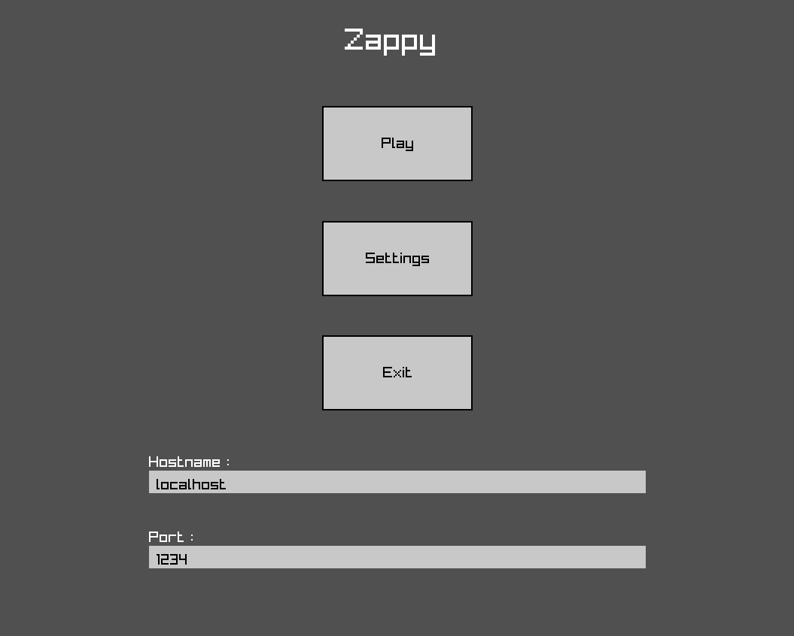
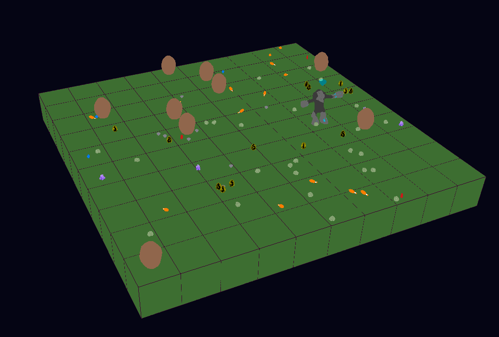

# ZAPPY

Zappy is an IT project where students must create multiples programs for each following part :
 - AI (which can play to a game) with free language (here python).
 - Graphic (to display a planet with residents) with C++ language.
 - Server (which can interact with the two other parts) with C language.


## Table of Contents

 - Project Description
 - Usage
 - Project Structure
 - Development
 - Tests
 - Contributors


## Project Description

The goal of this project is to create a network game in which many *trantorian* live on the *Trantor* planet in peace.
The goal of these trantorians is to level up in group to reach the 8th level and win the game.
To reach their goal, trantorians must find different stones which can be used for *elevation ritual* to level up.


## Usage

 - ### Clone repository
    In your terminal, execute this command to clone all necessary files :
    ```
    git clone git@github.com:EpitechPromo2028/B-YEP-400-LIL-4-1-zappy-yanis.monte.git
    ```

 - ### Build project
    Then execute this command to build all binaries :
    ```
    make re
    ```

   If you want to build a single binary, you can execute the following commands :\
   To build the server :
   ```
   make zappy_server
   ```

   To build the graphic :
   ```
   make zappy_gui
   ```

   To build AI :
   ```
   make zappy_ai
   ```

   If you want to clean Zappy folder, you can execute the following commands :\
   To remove only the object files :
   ```
   make clean
   ```

   And to clean all (binary included) :
   ```
   make fclean
   ```

 - ### Execute binaries
    To launch the game, we need to launch the server first :
    ```
    ./zappy_server -p <port> -x <width> -y <height> -n <name1> <name2> ... -c <clientNb> -f <frequence>
    ```
    `<port>` : port number used by the server.\
    `<width>` : width of the map.\
    `<height>` : height of the map.\
    `<name>` : all team names available.\
    `<clientNb>` : number of slots available per team.\
    `<frequence>` : frequence used to execute trantorian actions (non mandatory, 100 by default).

    You have to replace all variable between `<>` by real variables.
    Here is an exemple :
    ```
    ./zappy_server -p 1234 -x 15 -y 15 -n team1 team2 team3 -c 10 -f 10
    ```

    Second, you must launch the graphic :
    ```
    ./zappy_gui -p <port> -h <machine>
    ```
    `<port>` : port number used by the server (same number as for the server).\
    `<machine>` : hostname of the server.

    Here is an exemple :
    ```
    ./zappy_gui -p 1234
    ```

    Finally, you must launch the AI :
    ```
    ./zappy_ai -p <port> -n <name> -h <machine>
    ```
    `<port>` : port number used by the server (same number as for the server and graphic).\
    `<name>` : name of the ai team.\
    `<machine>` : hostname of the server (non mandatory, "localhost" by default).

    Here is an exemple :
    ```
    ./zappy_ai -p 1234 -n team1
    ```
    When you launched an AI, you "create" a player. So if you want your player win, you need to launch as many AI as you need to win (at least 10 in the same team in our case).

 - ### What can I do with the graphic
   First, when you launched the graphic, a new window appear with the following menu:
   \
   This menu allows you to :
   - Display the game (Play)
   - See settings (Settings)
   - Quit the program (Exit)
   - Change server hostname
   - Change server port

   When you click on "Play", you can see the Trantor planet with many resourcies(and trantorian if you launched AI program). It must look like this :\
   \
   You can :
      - **zoom in/out** : press "ctrl" key and use the mouse wheel.
      - **change camera orientation** : press "ctrl" key and move mouse.
      - **move in space** : press "ctrl" key and use { z, q, s, d } key (z = forward, q = left, s = back, d = right).
      - **view player information** : click on a player.
      - **turn around player**: click on a player then press "ctrl" key.
      - **exit player view** : click on "esc" key.
      - **view tile information** : press "shift" key and click on a tile.
      - **toggle number of players/eggs** : click on "P" key.
      - **toggle broadcasting** : click on "B" key.
      - **see/unsee resourcies** : click on { &, é, ", ', (, -, è, ) } key.
      - **exit to game menu** : click on "esc" key.

## Project Structure

```
Zappy/
|-- Ai
|   |-- src
|       |-- all ".py" files containing AI program.
|
|-- assets
|   |-- all assets for resourcies, player, eggs, ...
|
|-- Debug
|   |-- all files to build a logger library.
|
|-- docs
|   |-- image
|   |   |-- all screenshots from game.
|   |
|   |-- README.md
|
|-- Gui
|   |-- include
|   |   |-- all interfaces files.
|   |
|   |-- src
|       |-- many sub folders for each graphic element (player, menu, map, resourcies, server client, inventory, button, ...).
|
|-- Makefile
|
|-- Server
|   |-- include
|   |   |-- all ".h" files.
|   |
|   |-- src
|       |-- all ".c" files.
|
|-- tests
|   |-- all tests files organized by sub folder for each part (AI, graphic, server)
```

## Developement

To realize this project we have decided to split the groupe in three to cover each part per pair. Each pair uses different branches in github and merges its branches when it has a new feature. We have worked all days at school in group to facilitate communication between "sub group".


## Tests

To test AI program, we use the pytest library.\
To run these test you must run the following command :
```
make tests_run
```


## Contributors

 - yanis.monte@epitech.eu
 - martin.bonte@epitech.eu
 - pierre.ryssen@epitech.eu
 - timote.koenig@epitech.eu
 - antoine.orange@epitech.eu
 - clement.augustinowick@epitech.eu
